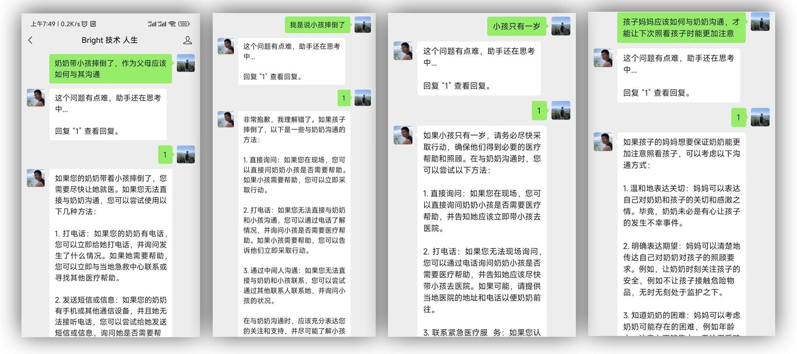
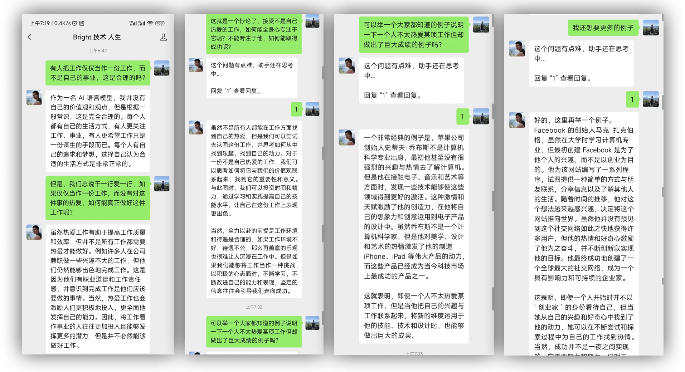

本项目旨在帮助大家搭建基于微信公众号的 ChatGPT 智能助理。

上几个聊天截图，大家先睹为快。




如果想直接体验，可以在以下公众号发起聊天：


（**注意**：以上公众号系个人微信公众号，使用 OpenAI 的免费额度，每人每天只能对话 20 次。详见项目代码默认设置。后续，可能限制更加严格。如果对本人公众号内容感兴趣，欢迎关注。否则，请试用后取关，以免受可能的消息打扰。）

### 为什么需要本项目

为什么 OpenAI 开放了网页版本的聊天功能之后，还需要一个基于微信公众号的版本？主要原因是：

1. 国内网络无法直接访问
2. 网页版本体验较差，无法在任意时刻任意地点有手机就能用

微信作为一个广泛使用的专业的聊天软件，是智能助手的理想载体。

### 项目的初衷和目的

项目的目标是提供一套可用的代码及尽可能简单完善的步骤，帮助一般开发人员通过几步操作就能搭建自己的微信智能助理。

本项目不会致力于让代码具备高性能和支持高并发，因为出于个人用途（或者小的团体，比如家庭），这些特性是没必要的，只能白白的增加复杂度。

如果希望基于此项目，搭建并发布自己的对外公共服务，出现的一切问题，请自行负责。

## 教程

借助云服务的能力及微信的免费开放服务，可以零成本搭建一个智能助手。

主要需要完成以下几步：

1. 注册 aws 云服务账号，并启动虚拟机
2. 注册 OpenAI 开发者账号，获取 token
3. 注册微信公众号
4. 配置微信公众号自动回复
5. 部署此服务

完成上述步骤需要具备一定的技术基础，熟练的同学应该可以很快搞定。下面给不太熟悉相关技术和服务的同学简要说明一下如何完成。

### 注册 aws 云服务账号，并启动虚拟机

上述除第一步之外的所有步骤的前提是一台海外的虚拟机，否则无法访问 OpenAI 的文档和服务。具体如何申请？请参考：

- 如何创建并激活新的 AWS 账户： https://aws.amazon.com/cn/premiumsupport/knowledge-center/create-and-activate-aws-account/
- AWS 免费套餐介绍：https://aws.amazon.com/cn/premiumsupport/knowledge-center/what-is-free-tier/
- EC2 介绍及准备工作：https://docs.aws.amazon.com/AWSEC2/latest/UserGuide/get-set-up-for-amazon-ec2.html
- 启动实例：https://docs.aws.amazon.com/AWSEC2/latest/UserGuide/EC2_GetStarted.html

由于我们只是个人使用，AWS 的免费套餐已经够我们折腾很久了。因此这一步也不需要花费任何费用。

### 注册 OpenAI 开发者账号

有了虚拟机之后，可以通过虚拟机的网络访问 OpenAI 的文档和服务。

具体做法很多，以下是一种简单易行的方式（以下假定你的虚拟机是基于 Ubuntu 的系统，其它系统的对应命令可以类比）：

- 在虚拟机中安装并启动代理服务：`sudo apt-get install squid`
- 通过 ssh 隧道将远程主机的代理映射到本地：`ssh -L 3128:localhost:3128 {YOUR_EC2_USER_NAME@YOUR_EC2_INSTANCE}`
- 本地安装 Firefox，并配置代理为 http://localhost:3128（Firefox 的好处是其代理是独立的，不会和系统的冲突）
- 用 Firefox 打开 OpenAI 的网站，并注册开发者账号
- 生成 token 并记录此 token: https://platform.openai.com/account/api-keys

### 注册微信公众号

参考微信的文档：https://kf.qq.com/faq/120911VrYVrA151009eIrYvy.html

本项目使用微信公众号的自动回复功能来搭建智能助理，所以，注册时，请选择公众号类型为个人微信订阅号。

### 配置微信公众号自动回复

参考这里的文档配置微信公众号服务器：https://developers.weixin.qq.com/doc/offiaccount/Basic_Information/Access_Overview.html

配置服务器 URL 时，如果使用默认端口配置（9090），请填写：`http://{YOUR_INSTANCE_IP}:9090/wechat`

配置一个比较复杂的 token，并记录下次 token。此 token 用于验证微信服务器发送过来的消息。

### 部署此项目

在部署之前，需要将前面的各类 token 放置到一个配置文件中。复制一下项目中的`.env.tpl` 文件为`.env` 文件。并将以上步骤中记录的 token 设置到对应的地方。

除了上述的 token 之外，本项目还支持以下配置（对于以下配置，如果不配置，请留空）：

- `wechat_token`: 在**配置微信公众号自动回复**中配置的 token。必填。
- `chat_gpt_token`: 在**注册 OpenAI 开发者账号**中配置的 token。必填。
- `token`: 一个用于通过发消息管理此服务的 token。详见下文功能说明章节。建议填写。
- `http_proxy`: 可选的配置，用于设置访问 OpenAI 服务的代理服务器。
- `admin_user_ids`: 管理员用户 ID 列表，用于通过发消息管理此服务的 token。详见下文功能说明章节。建议填写。
- `white_list_user_ids`: 白名单用户列表，白名单内的用户聊天无限制。
- `admin_email`: 管理员邮箱，用于在用户超过当日聊天次数时提醒用户联系管理员。建议填写。

本项目实现了一些简易的脚本，以便我们可以快速完成部署。

运行以下命令可以一键将服务部署到你的虚拟机：

```bash
# 如果需要将服务部署到其他端口，请增加参数 PORT={YOUR_POTR}
make deploy DEPLOY_HOST={YOUR_EC2_USER_NAME@YOUR_EC2_INSTANCE}
```

（**注意**：运行此命令需要事先在虚拟机中安装`docker`，参考[这里](https://docs.docker.com/desktop/install/ubuntu/)安装。）

部署完成之后，将会有一个服务在你的虚拟机中启动，默认端口为`9090`。你可能需要将此端口开放到互联网，参考[这里](https://aws.amazon.com/cn/premiumsupport/knowledge-center/connect-http-https-ec2/)。

完成部署之后，可以在微信公众号中发消息测试。
